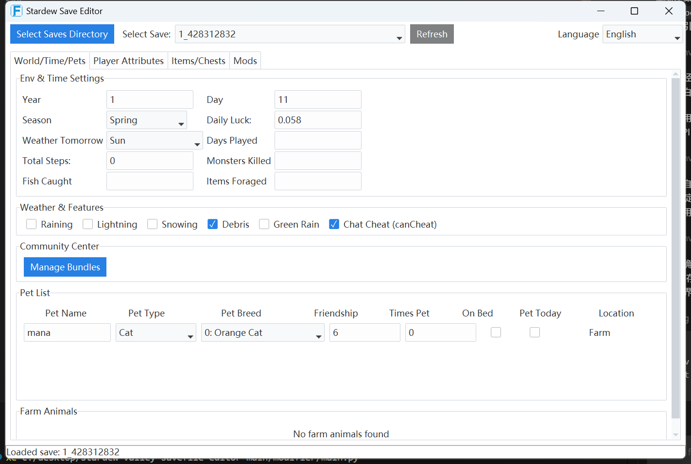
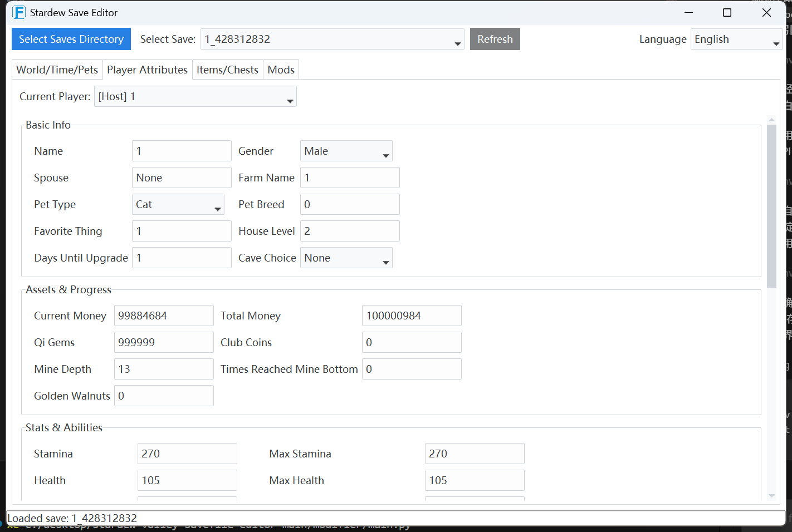
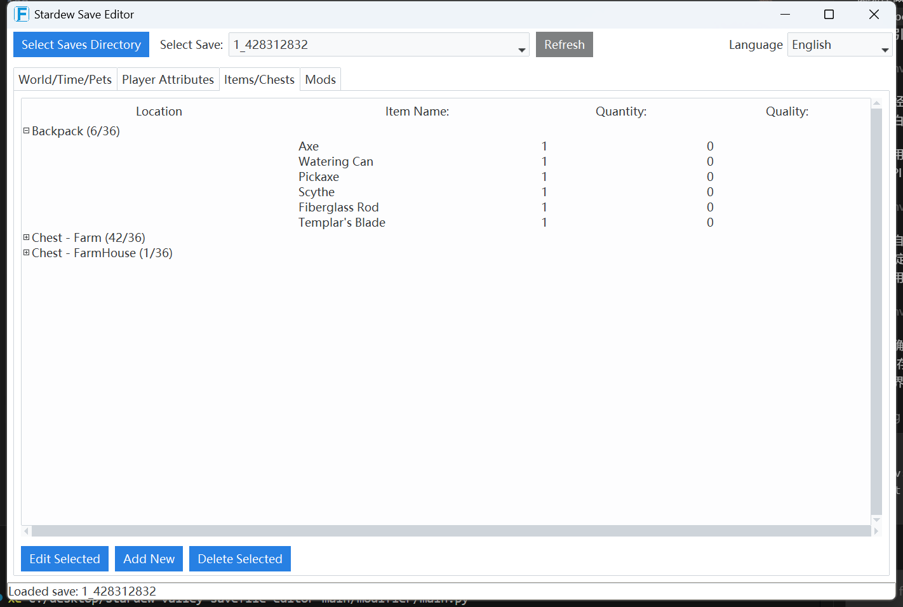
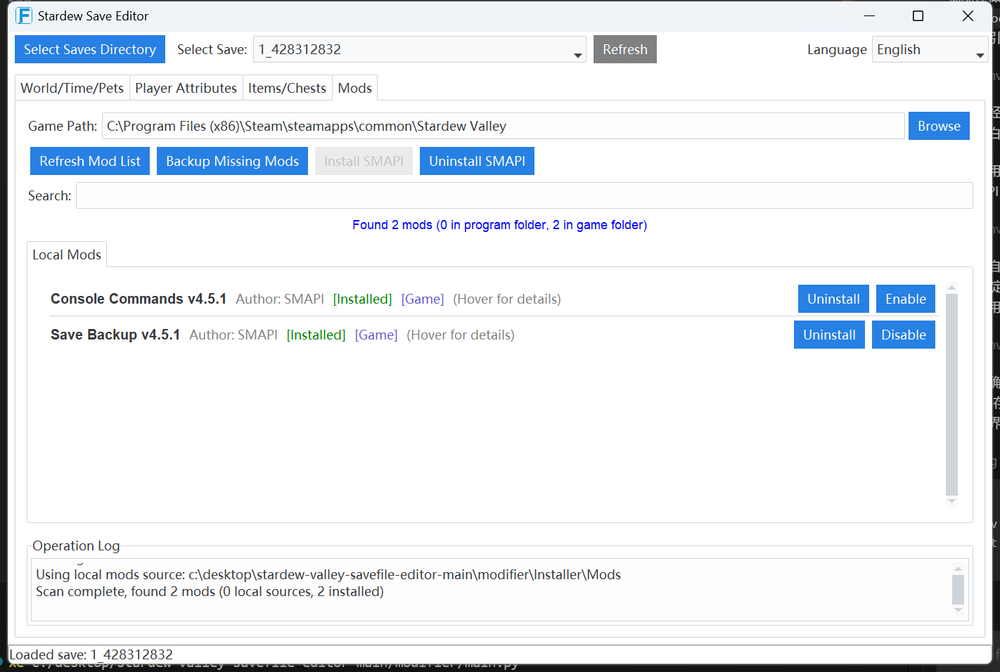

# Stardew Valley Save Editor

一个面向《Stardew Valley / 星露谷物语》的桌面存档编辑器项目。  
项目基于 Python 和 Tk/ttkbootstrap，重点覆盖存档编辑、物品与配方管理、进度与特殊状态编辑、本地 Mod 管理，以及中英文界面。

## 界面截图

### 世界 / 时间 / 宠物



### 玩家属性



### 物品 / 箱子



### Mods 管理



## 项目概览

这个仓库不是单一脚本，而是一个完整的桌面应用项目，包含：

- 存档加载、解析、保存和备份
- 玩家、世界、宠物、动物、箱子、物品等可视化编辑
- 烹饪配方、制作配方、技能专精、成就、邮件标记等进度项编辑
- 本地 Mod 管理、SMAPI 安装/卸载、游戏路径检测
- 中英文 i18n、本地化物品名称和游戏术语映射
- PyInstaller 打包脚本和发布产物

核心入口是 `modifier/main.py`，打包入口是 `build_exe.py`。

## 主要功能

- 存档编辑
  - 玩家基础信息、金钱、体力、生命、技能等级、经验、职业
  - 世界日期、天气、幸运、金核桃、矿井进度等
  - 宠物、农场动物、箱子、背包内容
- 物品管理
  - 支持按分类选择物品
  - 支持数量、品质、部分装备槽位和特殊物品编辑
  - 物品名显示支持本地化
- 进度管理
  - 烹饪与制作配方
  - 成就、钱包物品、邮件标记
  - 社区中心收集包
- Mod 管理
  - 自动检测游戏目录
  - 扫描程序目录和游戏目录中的 Mod
  - 安装、卸载、启用、禁用、备份缺失 Mod
  - 安装/卸载 SMAPI
- 本地化
  - 当前内置 `en` / `zh`
  - 大量物品、地点、NPC、收集包、天气、邮件标记术语已做中文化

## 项目结构

### 根目录

- `modifier/`
  - 主程序源码、资源文件、i18n、生成数据、SMAPI 安装资源
- `docs/screenshots/`
  - README 使用的界面截图
- `dist/`
  - PyInstaller 打包输出目录
- `build_exe.py`
  - PyInstaller 打包脚本
- `requirements.txt`
  - Python 依赖列表
- `SAVEFILE_STRUCTURE.md`
  - 存档结构说明文档
- `UNSUPPORTED_FIELDS_REPORT.md`
  - 未覆盖字段分析报告

### `modifier/` 目录

- `main.py`
  - 桌面程序入口
- `ui/`
  - 界面层
  - `editor_ui.py` 负责主编辑器壳层
  - `dialogs.py` 负责弹窗
  - `pages/` 按页面拆分 UI
- `models/`
  - 存档对象模型和数据代理
  - 例如玩家、物品、箱子、宠物、动物、配方、特殊能力
- `utils/`
  - 工具层
  - 包含存档读写、本地化、游戏路径检测、SMAPI 安装、Steam 启动项处理等
- `generated/`
  - 运行时使用的 JSON 数据
  - 包括物品、配方、建筑、尺寸、动物等表
- `i18n/`
  - 语言包
- `Installer/SMAPI/`
  - 随项目分发的 SMAPI 安装资源
- `F.ico` / `F.png`
  - 应用图标资源

## 运行环境

- Windows
- Python 3.11+
- 建议使用虚拟环境

依赖安装：

```bash
pip install -r requirements.txt
```

## 启动项目

源码方式运行：

```bash
python modifier/main.py
```

程序会直接在本地读取存档，不会上传存档文件。

## 打包 EXE

打包命令：

```bash
python build_exe.py
```

打包完成后输出：

```text
dist/StardewSaveEditor.exe
```

当前打包脚本会一并带上：

- `modifier/i18n`
- `modifier/generated`
- 图标资源
- `modifier/Installer/SMAPI/install.dat`

## 数据与资源说明

### `modifier/generated`

这里的 JSON 文件是程序运行时依赖的数据表，不建议随意删除。  
例如：

- `iteminfo.json`
- `cookingrecipes.json`
- `craftingrecipes.json`
- `buildings.json`
- `dimensions.json`
- `farmanimals.json`

### `modifier/i18n`

当前语言包：

- `en.json`
- `zh.json`

这些文件用于界面文本和部分游戏固定术语的显示。

### `modifier/Installer/SMAPI`

用于 Mod 页面中的 SMAPI 安装/卸载功能。  
如果删除这里的安装资源，程序本体仍可运行，但 SMAPI 安装功能会失效。

## 第三方组件与外部资源

### SMAPI

项目内随附的 SMAPI 安装资源来源：

- 官方仓库: https://github.com/Pathoschild/SMAPI

它在本项目中的作用：

- 为 Mods 页面提供 SMAPI 安装 / 卸载能力
- 作为 Stardew Valley Mod 运行环境
- 配合 Steam 启动项修改，让 Steam 启动游戏时转为通过 `StardewModdingAPI.exe` 启动

需要注意的行为：

- 安装 SMAPI 后，程序会自动尝试写入 Steam 中 Stardew Valley 的启动项
- 卸载 SMAPI 时，程序会尝试移除由本项目写入的启动项
- 程序修改的是 Stardew Valley 对应的 Steam 启动配置，不是整个 Steam 的全局设置
- 如果无法写入 Steam 配置，程序会记录日志，但不会因为这一步直接退出

### Steam 自动关闭说明

在执行需要释放游戏文件的操作时，程序会尝试自动关闭 Steam。当前逻辑是：

- 先调用 `steam://exit`
- 如果 Steam 仍未退出，再尝试结束 `steam.exe`
- 同时结束 `steamwebhelper.exe`
- 不使用递归终止整个子进程树的方式，因此不会因为自动关闭 Steam 而顺带关闭本编辑器

如果自动关闭 Steam 失败：

- 当前安装 / 卸载流程会中止
- 编辑器本身仍然保持运行
- 用户可以手动关闭 Steam 后重新执行操作


## Mod 管理说明

项目中的 Local Mods 页面会同时处理两类 Mod：

- 程序目录中的本地 Mod 源
- 游戏目录中的已安装 Mod

默认会使用并维护下面两个目录：

- `modifier/mods/`
  - 程序目录下的本地 Mod 源目录
  - 如果目录不存在，程序会自动创建
- `<GamePath>/Mods/`
  - Stardew Valley 游戏目录下的已安装 Mod 目录

支持的典型操作：

- 扫描本地 Mod
- 扫描游戏 `Mods` 目录
- 安装到游戏
- 从游戏卸载
- 启用 / 禁用
- 将游戏中存在但程序目录中不存在的 Mod 备份到本地 `mods` 目录

典型工作流：

1. 选择或自动检测游戏目录
2. 刷新 Mod 列表，合并显示程序目录和游戏目录中的 Mod
3. 对本地 Mod 执行安装，或对游戏中的 Mod 执行卸载 / 启用 / 禁用
4. 如有需要，使用 `Backup Missing Mods` 将游戏目录中的独有 Mod 备份回程序目录

关于 SMAPI 来源、Steam 启动项修改和 Steam 自动关闭行为，见上面的“第三方组件与外部资源”章节。

## 安全说明

- 修改存档前，程序会尽量做备份，但仍建议手动保留原始存档副本
- 一些字段存在游戏版本和 Mod 差异，编辑后应进游戏验证
- Mod 安装、Steam 启动项和 SMAPI 操作会直接影响本地游戏目录，应确认路径正确

## 开发说明

如果你准备继续维护这个项目，优先关注这几个区域：

- `modifier/ui/`
  - 界面和交互
- `modifier/models/`
  - XML 存档模型和字段映射
- `modifier/utils/game_text_localization.py`
  - 游戏术语和邮件标记等本地化规则
- `modifier/utils/item_localization.py`
  - 物品名本地化
- `modifier/models/mod_data.py`
  - 本地 Mod 扫描、安装、备份逻辑
